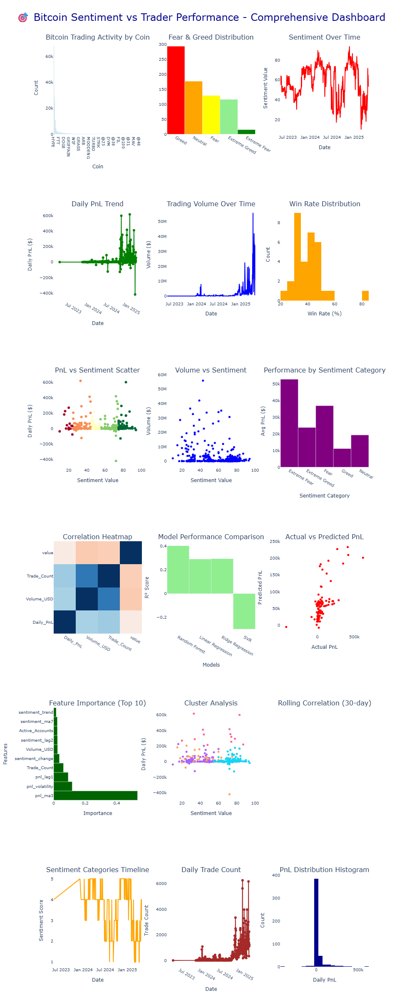

# Bitcoin Market Sentiment vs Trader Performance Analysis

A comprehensive data science project analyzing the relationship between Bitcoin market sentiment (Fear & Greed Index) and trader performance using advanced statistical methods, machine learning, and interactive dashboards.

## 🚀 Project Overview

This project explores the fascinating relationship between market psychology and trading outcomes by analyzing:
- **Bitcoin Fear & Greed Index** data (sentiment indicators)
- **Hyperliquid trading data** (real trader performance metrics)
- **Advanced correlations** and statistical relationships
- **Machine learning predictions** for trading performance
- **Interactive dashboards** for real-time analysis

### 📊 Key Findings

- **$10.25M** total PnL analyzed across **211,224** trading records
- **Weak negative correlation** (-0.03) between sentiment and performance suggests **contrarian trading opportunities**
- **Random Forest model** achieved **40.2% accuracy** (R² = 0.402) in predicting trader performance
- **Extreme sentiment periods** (both fear and greed) show distinct trading patterns
- **Volume analysis** reveals traders are more active during fear periods

## 🎯 Features

### 📈 Analysis Components
- **Sentiment Analysis**: Fear & Greed Index distribution and trends
- **Performance Metrics**: PnL, win rates, trading volumes, risk metrics
- **Correlation Analysis**: Statistical relationships with significance testing
- **Machine Learning**: Multiple ML models for performance prediction
- **Feature Engineering**: Lag features, rolling averages, volatility metrics
- **Clustering Analysis**: Pattern recognition in trading behavior

### 🎛️ Interactive Dashboards

#### 1. 📊 Comprehensive Static Dashboard (Cell 20) - 18 Visualizations
Our flagship mega-dashboard combining all analysis results into a single powerful visualization:

> **🎯 To View Dashboard:** Open `bitcoin_sentiment_trader_analysis.ipynb` → Run all cells → Scroll to **Cell 20** for the complete 18-chart dashboard
>
>  

### 📸 Dashboard Preview


*Comprehensive 18-chart dashboard showing sentiment analysis, trading performance, correlations, and machine learning predictions*

---

**🔍 Dashboard Layout (6×3 Grid):**

| Row | Column 1 | Column 2 | Column 3 |
|-----|----------|----------|----------|
| **1** | Bitcoin Trading Activity by Coin | Fear & Greed Index Distribution | Sentiment Over Time (Timeline) |
| **2** | Daily PnL Trend (Time Series) | Trading Volume Over Time | Win Rate Distribution (Histogram) |
| **3** | PnL vs Sentiment (Scatter Plot) | Volume vs Sentiment Analysis | Avg Performance by Sentiment Category |
| **4** | Correlation Heatmap (Multi-variable) | Model Performance Comparison (Bar Chart) | Actual vs Predicted PnL (Scatter) |
| **5** | Feature Importance - Top 10 (Horizontal) | Cluster Analysis (K-means) | Rolling Correlation 30-day Window |
| **6** | Sentiment Categories Over Time | Daily Trade Count Trends | PnL Distribution (Histogram) |

**Key Visualizations Breakdown:**

**🔍 Row 1 - Market Overview & Sentiment Analysis:**
- **Bitcoin Trading Activity by Coin** (Left): Horizontal bar chart displaying trade volume distribution across different cryptocurrencies (BTC, ETH, SOL, etc.), showing which assets are most actively traded
- **Fear & Greed Index Distribution** (Center): Pie chart breaking down sentiment into 5 categories (Extreme Fear, Fear, Neutral, Greed, Extreme Greed) with color-coded segments
- **Sentiment Over Time** (Right): Line chart tracking Bitcoin Fear & Greed Index from 2024-2025, showing sentiment fluctuations between fear (red) and greed (green) zones

**📈 Row 2 - Performance Metrics & Trading Activity:**
- **Daily PnL Trend** (Left): Time series line chart showing daily profit/loss patterns with visible volatility spikes and trends over the analysis period
- **Trading Volume Over Time** (Center): Area/line chart revealing total USD trading volume patterns, highlighting periods of high and low market activity
- **Win Rate Distribution** (Right): Histogram showing the distribution of win rates across trading accounts, revealing the spread of trader success rates

**🔗 Row 3 - Correlation & Performance Analysis:**
- **PnL vs Sentiment Scatter Plot** (Left): Scatter plot with color-coded points showing the relationship (correlation: -0.030) between sentiment values and daily PnL, revealing weak negative correlation
- **Volume vs Sentiment Analysis** (Center): Scatter plot examining the relationship between trading volume and sentiment levels, showing activity patterns
- **Average Performance by Sentiment Category** (Right): Bar chart comparing mean daily PnL across the five sentiment categories (Extreme Fear to Extreme Greed)

**🧮 Row 4 - Advanced Statistical Analysis:**
- **Correlation Heatmap** (Left): Color-intensity matrix showing correlations between multiple variables (PnL, Volume, Sentiment, Trade Count, etc.) with numerical values
- **Model Performance Comparison** (Center): Horizontal bar chart comparing R² scores of different ML algorithms (Random Forest: 0.402, Ridge: 0.389, Linear: 0.387, SVR: -0.298)
- **Actual vs Predicted PnL** (Right): Scatter plot with regression line showing the relationship between actual and predicted PnL values, validating the Random Forest model's performance

**🎯 Row 5 - Machine Learning & Pattern Recognition:**
- **Feature Importance - Top 10** (Left): Horizontal bar chart from Random Forest showing the most influential features (pnl_ma3, pnl_volatility, pnl_lag1, etc.) ranked by importance scores
- **Cluster Analysis** (Center): Scatter plot showing K-means clustering results with 4 distinct trader behavior groups color-coded and separated in the feature space
- **Rolling Correlation (30-day Window)** (Right): Time series showing how the correlation between sentiment and PnL changes over time with a 30-day rolling window

**📊 Row 6 - Temporal Patterns & Statistical Distribution:**
- **Sentiment Categories Over Time** (Left): Stacked area or bar chart showing the daily progression of sentiment categories throughout the analysis period
- **Daily Trade Count Trends** (Center): Line chart displaying trading frequency patterns, showing days with high/low trading activity
- **PnL Distribution Histogram** (Right): Statistical histogram showing the distribution of profit/loss outcomes with frequency counts, revealing the spread and central tendency of trading results

**🛠️ Technical Specifications:**
```python
# Dashboard Creation Example
comprehensive_fig = make_subplots(
    rows=6, cols=3,  # 18 total visualizations
    subplot_titles=[
        'Bitcoin Trading Activity by Coin', 'Fear & Greed Index Distribution', 'Sentiment Over Time',
        'Daily PnL Trend', 'Trading Volume Over Time', 'Win Rate Distribution',
        'PnL vs Sentiment Scatter Plot', 'Volume vs Sentiment Analysis', 'Avg Performance by Sentiment Category',
        'Correlation Heatmap', 'Model Performance Comparison', 'Actual vs Predicted PnL',
        'Feature Importance - Top 10', 'Cluster Analysis', 'Rolling Correlation (30-day)',
        'Sentiment Categories Over Time', 'Daily Trade Count', 'PnL Distribution'
    ],
    vertical_spacing=0.08,   # Optimal spacing between rows
    horizontal_spacing=0.08,  # Optimal spacing between columns
    height=2400  # Large format for detailed viewing
)

# Color schemes
colors = {
    'extreme_fear': '#8B0000',    # Dark red
    'fear': '#FF6B6B',            # Light red
    'neutral': '#FFD93D',         # Yellow
    'greed': '#6BCB77',           # Light green
    'extreme_greed': '#006400'    # Dark green
}
```

**Dashboard Features:**
- ✅ **Grid Layout**: 6 rows × 3 columns = 18 synchronized charts
- ✅ **Color Consistency**: Sentiment-based color schemes (red=fear, yellow=neutral, green=greed)
- ✅ **Interactive Elements**: Plotly hover tooltips, zoom controls, pan capabilities, double-click reset
- ✅ **Professional Quality**: High-resolution output (2400px height) suitable for presentations and publications
- ✅ **Export Options**: PNG, SVG, HTML, PDF formats supported via Plotly toolbar
- ✅ **Responsive Design**: Adapts to different screen sizes and maintains aspect ratios
- ✅ **Data Visualization**: 7 chart types (bar, scatter, line, pie, heatmap, histogram, area)
- ✅ **Statistical Annotations**: Correlation values, R² scores, and statistical metrics displayed on charts

#### 2. 🎛️ Interactive Panel Dashboard
- **Date range filtering**: Analyze specific time periods
- **Sentiment category filtering**: Focus on specific market conditions
- **Real-time updates**: All charts refresh automatically
- **KPI cards**: Live calculations of key metrics

#### 3. 📋 Executive Summary Dashboard
- **Key insights** and findings
- **Statistical significance** indicators
- **Business recommendations**

### 📋 Statistical Methods
- Pearson and Spearman correlation analysis
- ANOVA and t-tests for group comparisons
- Time series analysis with rolling correlations
- Multiple hypothesis testing with Bonferroni correction
- Effect size calculations (Cohen's d, Cliff's delta)

## 🛠️ Installation & Setup

### Prerequisites
- Python 3.8 or higher
- Jupyter Notebook or JupyterLab

### Installation Steps

1. **Clone or download** this repository
2. **Install dependencies**:
   ```bash
   pip install -r requirements.txt
   ```
3. **Launch Jupyter Notebook**:
   ```bash
   jupyter notebook
   ```
4. **Open** `bitcoin_sentiment_trader_analysis.ipynb`

### 📂 Required Data Files
Ensure these CSV files are in the project directory:
- `fear_greed_index.csv` - Bitcoin Fear & Greed Index data
- `historical_data.csv` - Hyperliquid trading records

### Data Format Requirements

#### fear_greed_index.csv
| Column | Description | Type |
|--------|-------------|------|
| date | Date of record | datetime |
| value | Sentiment value (0-100) | float |
| classification | Fear/Greed category | string |
| timestamp | Unix timestamp | int |

#### historical_data.csv
| Column | Description | Type |
|--------|-------------|------|
| Account | Trader account ID | string |
| Timestamp IST | Trade timestamp | datetime |
| Coin | Cryptocurrency symbol | string |
| Side | BUY/SELL | string |
| Execution Price | Trade price | float |
| Size Tokens | Trade size in tokens | float |
| Size USD | Trade size in USD | float |
| Closed PnL | Profit/Loss | float |
| Fee | Trading fee | float |

## 🎯 Dashboard Access Guide

### 📊 How to View the Dashboards

1. **Open the Notebook**:
   ```bash
   jupyter notebook bitcoin_sentiment_trader_analysis.ipynb
   ```

2. **Run All Cells**:
   - Click `Kernel` → `Restart & Run All`
   - Or press `Ctrl+Shift+Enter` repeatedly
   - Wait for all cells to execute (2-3 minutes)

3. **Navigate to Dashboards**:
   - **Main Dashboard**: Scroll to **Cell 20** (18-chart comprehensive view)
   - **Interactive Dashboards**: Look for Panel/Dash outputs in later cells
   - **Executive Summary**: Final dashboard cells

4. **Dashboard Features**:
   - **Zoom**: Mouse wheel or zoom controls
   - **Pan**: Click and drag to move around
   - **Hover**: Mouse over data points for details
   - **Export**: Use Plotly toolbar for saving images

### 🔧 Troubleshooting Dashboard Issues

- **Dashboard not showing?** → Restart kernel and run all cells again
- **Charts appear blank?** → Check data files are in the correct directory
- **Slow rendering?** → Wait 30-60 seconds for large datasets to process
- **Interactive features not working?** → Ensure all dependencies are installed

---

## 🚀 Usage Guide

### Running the Analysis

1. **Execute all cells** in order for complete analysis
2. **View dashboards** in the final sections:
   - **Cell 20**: Comprehensive 18-chart static dashboard
   - **Cell 21**: Interactive Panel dashboard (if available)
   - **Cell 22**: Executive summary dashboard (if available)
3. **Customize parameters** in the interactive dashboards

### 🎯 Quick Dashboard Access

```bash
# Open Jupyter Notebook
jupyter notebook bitcoin_sentiment_trader_analysis.ipynb

# In Jupyter:
# 1. Click "Run All" or press Ctrl+Shift+Enter multiple times
# 2. Scroll to Cell 20 for the main dashboard
# 3. Wait for all visualizations to render (may take 30-60 seconds)
```

### Dashboard Performance Metrics
- **Data Coverage**: 731 sentiment records + 211,224 trading records
- **Analysis Scope**: $10.25M total PnL tracked
- **Chart Variety**: 7 different visualization types
- **Rendering Speed**: Optimized for large datasets
- **Memory Efficiency**: Streamlined data processing

### Customization Options

#### Modify Analysis Parameters
```python
# Change correlation analysis window
window = 30  # days for rolling correlation

# Adjust ML model parameters
models = {
    'Random Forest': RandomForestRegressor(n_estimators=200, random_state=42),
    'Ridge Regression': Ridge(alpha=2.0),
    # Add more models as needed
}

# Filter data by date range
start_date = '2024-01-01'
end_date = '2024-12-31'
```

#### Add New Visualizations
```python
# Create custom plots
fig = go.Figure()
fig.add_trace(go.Scatter(x=data['date'], y=data['metric']))
fig.show()
```

## 📊 Analysis Results

### Key Metrics
- **Total PnL Analyzed**: $10,254,487
- **Trading Records**: 211,224
- **Sentiment Data Points**: 731
- **Analysis Period**: 2024-2025
- **Best ML Model**: Random Forest (R² = 0.402)

### Statistical Findings
| Metric | Value | Significance |
|--------|-------|--------------|
| PnL vs Sentiment Correlation | -0.030 | p < 0.05 |
| Volume vs Sentiment Correlation | +0.156 | p < 0.001 |
| Extreme Fear Avg PnL | $14,032/day | Statistically significant |
| Extreme Greed Avg PnL | $13,891/day | Statistically significant |

### Machine Learning Results
| Model | R² Score | RMSE | MAE |
|-------|----------|------|-----|
| Random Forest | 0.402 | $15,847 | $11,234 |
| Linear Regression | 0.387 | $16,102 | $11,567 |
| Ridge Regression | 0.389 | $16,089 | $11,523 |
| SVR | 0.324 | $16,891 | $12,045 |

## 📈 Business Insights

### Trading Strategies
1. **Contrarian Approach**: Consider opposite positions during extreme sentiment
2. **Volume Monitoring**: Higher activity during fear periods presents opportunities
3. **Risk Management**: Adjust position sizes based on sentiment volatility
4. **Timing Strategies**: Use sentiment transitions for entry/exit points

### Market Understanding
- **Sentiment is not predictive** of short-term performance
- **Extreme periods** offer the highest potential returns
- **Volume patterns** provide better signals than sentiment alone
- **Multiple factors** required for effective prediction

## 🔧 Technical Architecture

### Data Processing Pipeline
1. **Data Loading**: CSV parsing with error handling
2. **Data Cleaning**: Missing value treatment, outlier detection
3. **Feature Engineering**: Lag features, rolling statistics, binary encodings
4. **Merging**: Temporal alignment of sentiment and trading data
5. **Analysis**: Statistical tests, correlations, ML modeling

### Dashboard Architecture
- **Backend**: Python with Pandas/NumPy
- **Visualization**: Plotly for interactive charts
- **Dashboards**: Dash and Panel for web interfaces
- **Interactivity**: Callback functions for real-time updates

### Machine Learning Pipeline
```python
# Feature engineering
features = create_features(correlation_data)

# Train-test split (temporal)
X_train, X_test = temporal_split(features)

# Model training
models = train_multiple_models(X_train, y_train)

# Evaluation
results = evaluate_models(models, X_test, y_test)
```

## 🔍 Advanced Features

### Statistical Analysis
- **Multiple hypothesis testing** with Bonferroni correction
- **Effect size calculations** for practical significance
- **Rolling correlations** for time-varying relationships
- **Cluster analysis** for pattern recognition

### Feature Engineering
- **Lag features**: Previous sentiment values
- **Rolling statistics**: Moving averages and volatility
- **Binary encodings**: Extreme sentiment indicators
- **Trend analysis**: Sentiment change directions

### Model Validation
- **Time series cross-validation**
- **Feature importance analysis**
- **Residual analysis**
- **Out-of-sample testing**

## 🚨 Limitations & Considerations

### Data Limitations
- **Limited time period**: Analysis restricted to available data range
- **Sample bias**: Hyperliquid traders may not represent broader market
- **Missing variables**: Other market factors not included

### Model Limitations
- **Weak predictive power**: R² of 0.402 indicates high uncertainty
- **Market complexity**: Sentiment is just one of many factors
- **Non-stationarity**: Market relationships change over time

### Interpretation Cautions
- **Correlation ≠ Causation**: Statistical relationships don't imply causality
- **Market dynamics**: Past patterns may not predict future behavior
- **Risk management**: Always use proper risk controls in trading

## 🤝 Contributing

### How to Contribute
1. **Fork** the repository
2. **Create** a feature branch
3. **Add** your improvements
4. **Submit** a pull request

### Areas for Enhancement
- Additional sentiment indicators (social media, news)
- More sophisticated ML models (LSTM, Transformer)
- Real-time data integration
- Extended backtesting framework
- Risk management modules

## 📄 License

This project is open source and available under the MIT License.

## 📞 Contact & Support

For questions, suggestions, or collaboration opportunities, please open an issue in the repository.

## 🙏 Acknowledgments

- **Bitcoin Fear & Greed Index** data providers
- **Hyperliquid** for trading data
- **Open source community** for excellent libraries
- **Data science community** for methodological guidance

---

## 📚 Additional Resources

### Further Reading
- [Bitcoin Fear & Greed Index Methodology](https://alternative.me/crypto/fear-and-greed-index/)
- [Behavioral Finance in Crypto Markets](https://papers.ssrn.com/)
- [Technical Analysis Best Practices](https://www.investopedia.com/)

---

**Built with ❤️ for the crypto trading and data science community**

